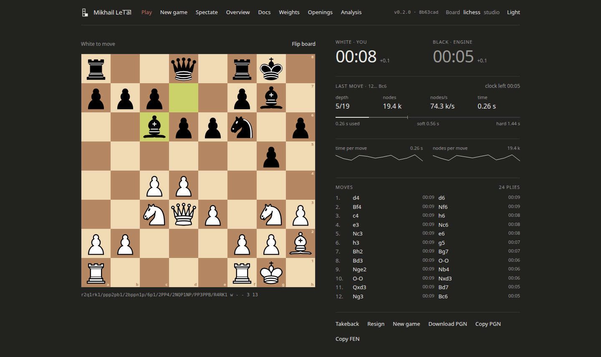
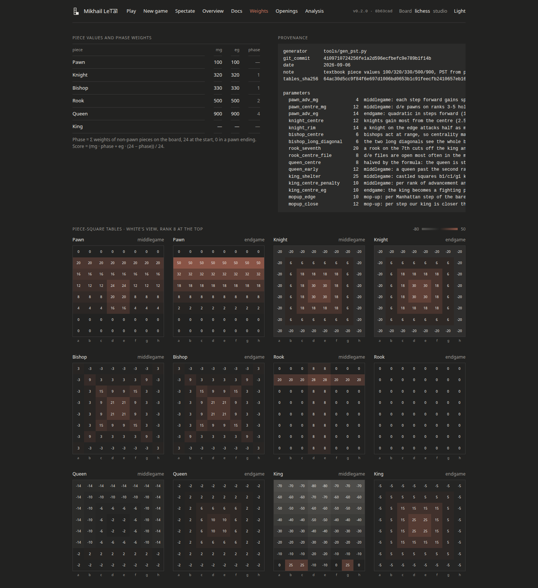
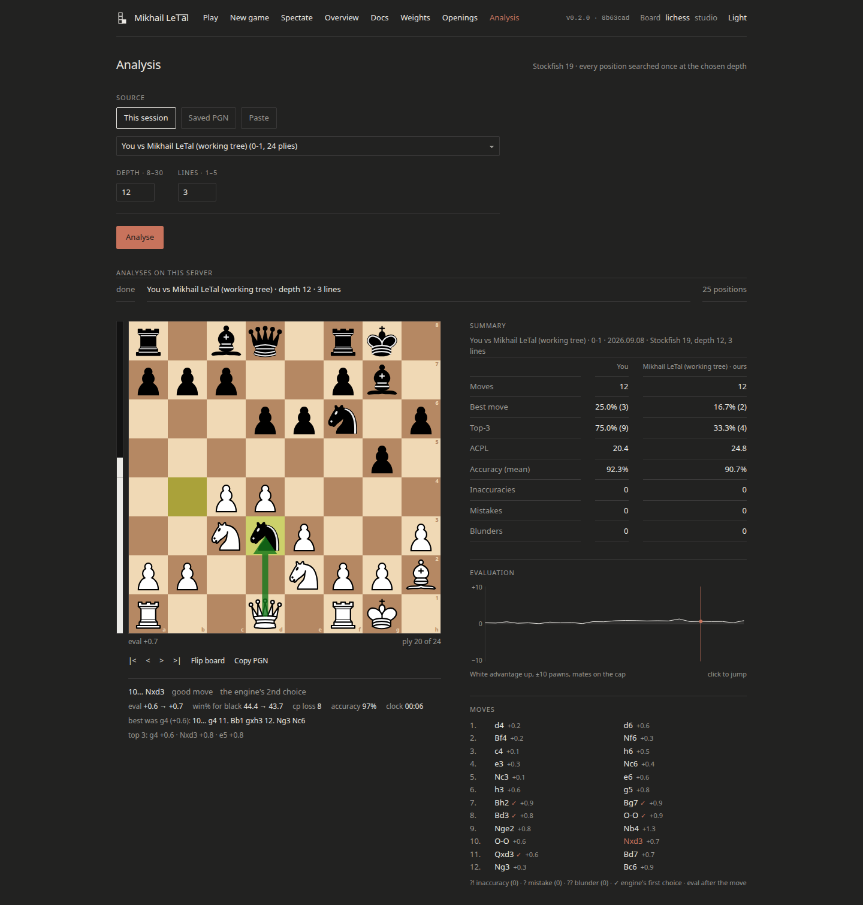

# Mikhail LeTal

A chess engine in plain Python, written for [AI Chessathon 2026](https://aichessathon.com). The
name is a pun on Mikhail Tal. The engine is nowhere near as brave as he was.

It plays at roughly **2050 on the CCRL 40/4 scale**, measured over 300 games against
rating-limited Stockfish at the competition's time control (interval 1940–2170, and see the
caveats in [docs/RESULTS.md](docs/RESULTS.md) before quoting that number anywhere). On one core
it searches over 50,000 positions per second and reaches depth 9 in three seconds from the
starting position.

## The problem

The competition fixes the environment, and most of the interesting decisions follow from it:

| | |
|---|---|
| Language | Python 3.12, five preinstalled packages, nothing else installs |
| Compiled code | Native binaries are rejected. No Cython, no C extension |
| Hardware | One core of an EPYC 9V74 at 2.60 GHz, 2 GB RAM, no network |
| Clock | 120 s + 0.5 s per move, per side, wall time |
| Start-up | 90 s before the clock starts |
| Losing for free | An illegal move, a crash, running out of memory or flagging loses the game outright |

One slow core and no compiler means node counts in the tens of thousands per second, not the
millions a C engine gets. That changes the trade: move ordering and evaluation quality buy more
than raw depth does, and every wasted node is expensive.

## What's inside

**Search.** Negamax with alpha-beta, iterative deepening, and a transposition table that survives
across moves in a game. Quiescence at the leaves so the evaluation is never measured mid-exchange.
Move ordering is the transposition move, then captures by most-valuable-victim, then two killer
moves per ply, then a history heuristic. Null-move pruning, late-move reductions, aspiration
windows, futility pruning at shallow depths, and delta pruning in quiescence. Each of those sits
behind a named constant so a regression can be bisected feature by feature. Together they cut the
tree from 238,000 nodes to 17,000 for a depth-6 search from the start.

**Evaluation.** Tapered material and piece-square tables that blend a middlegame view into an
endgame one as pieces leave the board, plus passed, doubled and isolated pawns, the bishop pair,
rooks on open files, and a middlegame king pawn shield. There is also a mop-up term so that king
and rook against a bare king actually converts, which a shallow search will not do on its own.

The tables are not copied from anywhere. [`tools/gen_pst.py`](tools/gen_pst.py) computes every one
of the 768 entries from a formula of the square's geometry with twenty-four named parameters, prints
them as 8×8 grids to be eyeballed, and records what produced them. Piece-square tables are the
part of an engine most likely to be reproduced from something you have read, and one of the house
bots on this ladder is Sunfish, whose tables the organisers know by sight. A mechanical comparison
against Sunfish, the Chess Programming Wiki's simplified tables, Rustic, TSCP and VICE found one
coincidental row, where our formula happens to put 50 on the seventh rank of the endgame pawn
table. That is written down in [docs/DECISIONS.md](docs/DECISIONS.md) rather than quietly fixed.

**Time management.** The budget comes from the clock the platform hands over, not from a constant.
A soft target decides whether to start another iteration; a hard deadline aborts the current one.
The search checks the clock every 128 nodes, and when the fifty-move rule or the 600-ply cap is
close it shortens its horizon so it has time to force the win before the referee calls the draw.
Over 71 logged moves in solo games the worst overshoot past the hard deadline was 2 milliseconds.

**Safety.** `get_move` cannot raise and cannot return an illegal move. Every path ends in a
validation against a fresh board built from the FEN, and anything that fails it falls back to a
one-ply capture search that answers in under a millisecond. Below a threshold on the clock the
engine skips the search entirely. If a position arrives that is not reachable from the last one we
played, the game history resets and says so in the log. Across nearly two thousand recorded
games there was no crash, no illegal move, no flag and no failure to start.

## Strength

| Opponent | Time control | Games | +W =D −L | Score |
|---|---|---|---|---|
| Random mover | 3 s + 0.05 s | 300 | +300 =0 −0 | 100% |
| Greedy (1 ply) | 10 s + 0.1 s | 200 | +200 =0 −0 | 100% |
| Minimax (2 ply) | 120 s + 0.5 s | 40 | +39 =1 −0 | 98.8% |
| Previous version | 120 s + 0.5 s | 60 | +48 =6 −6 | 85.0% |
| Stockfish, Elo 1800 | 120 s + 0.5 s | 60 | +44 =4 −12 | 76.7% |
| Stockfish, Elo 2000 | 120 s + 0.5 s | 60 | +25 =4 −31 | 45.0% |
| Stockfish, Elo 2200 | 120 s + 0.5 s | 60 | +16 =14 −30 | 38.3% |

Nothing gets promoted on a hunch. A version replaces the previous one only when it wins by a
margin whose 95% interval is above zero, at the real time control. Every run is in
[docs/RESULTS.md](docs/RESULTS.md) with its game count, interval, terminations and machine load,
including the runs that went nowhere.

The clearest example of that is the tuning experiment. I generated 26,000 quiet positions from
self-play, labelled them with Stockfish, and fitted all 786 evaluation weights by ridge regression
toward the hand-chosen prior. The fit was better on every measure that regression cares about:
validation error fell by a quarter. It then lost 300 games to the untuned version by about 100
Elo. A weaker regularisation was no better. So the tuned weights were thrown away and the prior
still ships. The script, the data and both failures are still in the repo, because the negative
result is the useful part.

## Playing against it

There is a small web app for playing, watching and analysing games. It runs locally with no
external dependencies, and it drives the engine through the same runner and clock the competition
uses, so what you see is what the ladder sees.

```
git clone https://github.com/urvancev06/chessathon
cd chessathon
uv sync
uv run python -m tools.webapp.server
```

Then open http://localhost:8000. You can play the engine at any time control, watch it against
Stockfish at a chosen strength, and analyse any finished game move by move if you have Stockfish
installed locally.



Every move it plays comes with the report it wrote about itself: the depth it reached, how many
positions it looked at, and where its time budget went.



The Weights screen reads `weights/pst.json` directly, so the twelve heatmaps are the numbers the
engine is actually using. It is the fastest way to see what it values and where the generator's
formula produced something odd.



If you have Stockfish installed locally, any finished game can be graded move by move: accuracy
and average centipawn loss per side, the evaluation curve, and what the engine should have played
at each ply.

Without the web app:

```
uv run python -m harness.play --white . --black baselines/minimax     # one game
uv run python -m tools.arena_openings --opponent versions/v0.1 --games 100   # a measured match
uv run python -m pytest -q                                            # 221 tests
```

## Layout

```
agent.py              the entry point: safety wrapper, time budget, game history
mikhail_letal/        search, evaluation, timing, game state, fallback
weights/              the generated tables, with their provenance
tools/                table generator, opening collector, arena, Texel tuner, the web app
app/                  the web app's front end
tests/                unit, property and regression tests
docs/                 design, decisions, results, provenance, calibration, the report
versions/             every uploaded build, kept as an opponent for the next one
harness/              the competition's local harness (from the starter repo, unmodified)
```

[docs/DESIGN.md](docs/DESIGN.md) is the module contract everything was written against.
[docs/DECISIONS.md](docs/DECISIONS.md) records each decision with the alternative that was
rejected and why. [docs/PROVENANCE.md](docs/PROVENANCE.md) says where every constant came from.
[docs/report.tex](docs/report.tex) is the long-form write-up.

## What I would do next

The obvious thing is speed. Everything above runs in interpreted Python, and numba is the only
route to compiled code that the rules allow. A jitted board representation and search should be
worth several plies, which is worth more than any evaluation term I could add by hand. I ran out
of time to do it safely, and a fast engine that plays one illegal move scores worse than a slow
one that never does.

Known weaknesses, all measured rather than guessed: rook endgame technique is poor, and the engine
does not convert the Lucena position at five seconds a move. King and queen against king can still
run into the fifty-move rule from a difficult starting square. There are no tablebases and no
opening book. The evaluation has never been successfully tuned.

## Notes

Every design decision here is written down with the alternative that was rejected, and every
constant can be traced to the script or the run that produced it. That is what
[docs/DECISIONS.md](docs/DECISIONS.md) and [docs/PROVENANCE.md](docs/PROVENANCE.md) are for.
Nothing shipped that had not won a measured match against the version before it.

Stockfish appears in this repo only as a measuring instrument: a sparring partner for rating
estimates, an analysis engine in the web app, and a labeller for the tuning experiment that
failed. It is not shipped, not consulted at runtime, and its source was never read.

Credits: the harness, the baselines and the original starter code are from
[advitrocks9/aichessathon-starter](https://github.com/advitrocks9/aichessathon-starter), MIT
licensed, and `harness/` is unmodified because local results are meaningless otherwise. The board
pieces in the web app are Colin M.L. Burnett's cburnett set, CC BY-SA 3.0. Everything else is MIT
licensed; see [LICENSE](LICENSE).
